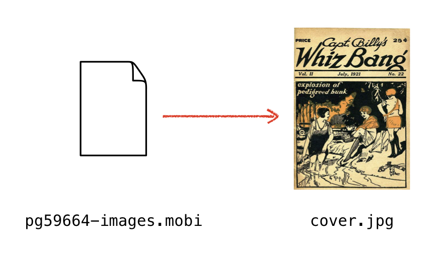

# get-mobi-cover-image

This is a script that allows you to get the cover image from files in the `.mobi` format.

Book cover: <em>Captain Billy's Whiz Bang</em>, from <a href="https://www.gutenberg.org/ebooks/59664">Project Gutenberg</a>.
