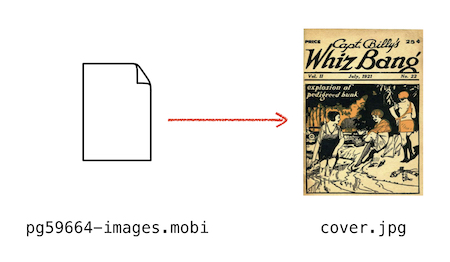

# get-mobi-cover-image

This is a Python script that gets the cover image from ebooks in the `.mobi` format.



Book cover: *Captain Billy's Whiz Bang*, from [Project Gutenberg](https://www.gutenberg.org/ebooks/59664).


## Motivation

I have an app ([alexwlchan/docstore](https://github.com/alexwlchan/docstore)) that I used to manage my scanned documents and my ebook collection.
To help me spot files quickly (and because it looks nice!), I create thumbnails of every document I store.

I've got a handful of MOBI files for my Kindle, but I didn't have a way to get a cover image from MOBI files.

The app doesn't care about the ebook contents, just the cover image.
I didn't need a full-blown MOBI parser, as long as I can get a thumbnail.
What I wanted was a single-purpose tool that takes a MOBI file, and extracts the cover image.

I couldn't find an existing tool to do that, but I did find some code that does the hard work of parsing a MOBI file -- this script ties it all together into that single-purpose tool.


## Installation

Clone or download this repository:

```console
$ git clone https://github.com/alexwlchan/get-mobi-cover-image.git
```

You also need to [install Python](https://www.python.org/).
I've tested the script with Python 2.7 and 3.6.


## Usage

Run the script `get_mobi_cover.py`, passing the path to the MOBI file you want a thumbnail for.
It saves the thumbnail to the current directory, and prints the name of the thumbnail file:

```console
$ python get_mobi_cover.py pg59664-images.mobi
cover-41bFd.jpeg
```

The image is saved directly as it's stored in the MOBI file -- same format, same bytes, no compression or interference.


## Technical details

Most of the heavy lifting is done by other people's code, which is included in this repo:

*   `File.py` is from [KindleButler](https://github.com/AcidWeb/KindleButler) by **Paweł Jastrzębski**.
    Used under GPL-3.

*   `DualMetaFix.py` by **K. Hendricks**.
    Used under GPL-3.

*   `KindleUnpack.py` by **M. Hannum, P. Durrant, K. Hendricks, S. Siebert, fandrieu, DiapDealer, nickredding**.
    Used under GPL-3.

I made a couple of changes to `File.py`, in particular:

*   Removing a dependency on the Pillow imaging library
*   Return the original image data, rather than a downsized/greyscale version


## License

GPL v3.
